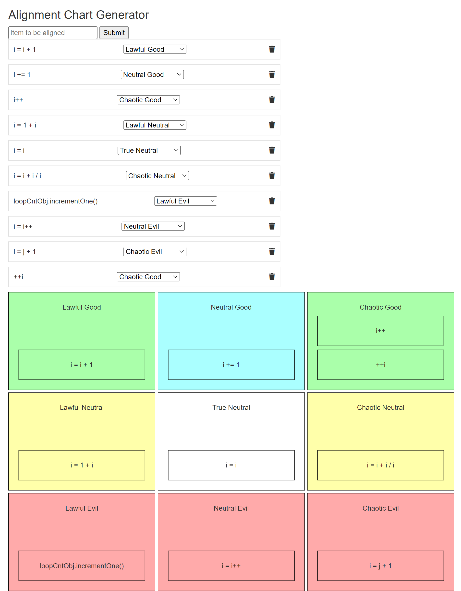

# Alignment Chart Generator 🧐🤔

### Description
Welcome to the Alignment Chart Generator, a web application that maps people, things, or ideas along two dimensions: (1) lawful vs. chaotic, and (2) good vs. evil.

Combining these dimensions, we get nine different alignments that things can fall into:
1. Lawful good
2. Neutral good
3. Chaotic good
4. Lawful neutral
5. True neutral
6. Chaotic neutral
7. Lawful evil
8. Neutral evil
9. Chaotic evil

The alignment chart originated in the Dungeons & Dragons (D&D) fantasy role-playing game to allow players to categorize their characters according to their moral and ethical values. Today, it has exploded in popularity across mainstream pop culture.

### How to Use
1. Sign up or log in using existing credentials.
2. Enter a person, thing, or idea in the "Item to be aligned" input and click on "Submit."
3. Once the item has been initialized, a dropdown menu appears, allowing you to select an alignment for the item.
4. Select an alignment, and the item will move to its specified grid in the 3x3 chart.
5. You can change an item's alignment by simply selecting a new dropdown option. You can also delete items altogether.

### Features
- **User Authentication**: Implements Passport.js for secure local authentication, ensuring user data protection.
- **Item Management**: Add, modify, and delete items associated with different alignments.
- **Dynamic Alignment Grid**: Visual representation of organized items.
- **Real-time Updates**: Dynamic updates to the UI when adding, modifying, or deleting items for a seamless user experience.

### Tech Used
- **HTML/CSS/JavaScript**: Frontend technologies for building an interactive and engaging user interface.
- **Node.js**: Backend JavaScript runtime.
- **Express.js**: Web application framework for Node.js, simplifying route handling and middleware integration.
- **Embedded JavaScript (EJS)**: Templating engine for rendering dynamic content, simplifying the integration of server-side variables into HTML.
- **MongoDB**: NoSQL database for storing user information, items, and item alignments.